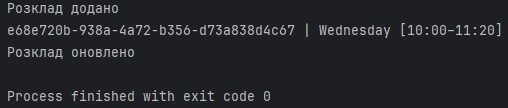
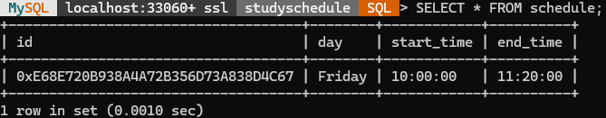

# Проєкт автономної бази даних Schedule

## Опис

Цей проєкт демонструє реалізацію автономної бази даних `schedule_db` для зберігання розкладу занять. База містить лише одну таблицю `schedule` без зовнішніх залежностей.

---

## 1. SQL скрипт створення бази даних і таблиці

```sql
CREATE DATABASE IF NOT EXISTS schedule_db;
USE schedule_db;

CREATE TABLE IF NOT EXISTS schedule (
    id BINARY(16) PRIMARY KEY,
    day ENUM('Monday','Tuesday','Wednesday','Thursday','Friday','Saturday') NOT NULL,
    start_time TIME NOT NULL,
    end_time TIME NOT NULL
);
```

**Пояснення:**  
- Створення бази `schedule_db`.  
- Таблиця `schedule` з полями:  
  - `id` — унікальний UUID у форматі `BINARY(16)`.  
  - `day` — день тижня (перераховані значення).  
  - `start_time` та `end_time` — час початку і закінчення заняття.

---

## 2. Клас-модель `Schedule.java`

```java
package com.example.model;

import java.util.UUID;
import java.time.LocalTime;

public class Schedule {
    private UUID id;
    private String day;
    private LocalTime startTime;
    private LocalTime endTime;

    public Schedule() {}

    public Schedule(UUID id, String day, LocalTime startTime, LocalTime endTime) {
        this.id = id;
        this.day = day;
        this.startTime = startTime;
        this.endTime = endTime;
    }

    public UUID getId() { return id; }
    public void setId(UUID id) { this.id = id; }

    public String getDay() { return day; }
    public void setDay(String day) { this.day = day; }

    public LocalTime getStartTime() { return startTime; }
    public void setStartTime(LocalTime startTime) { this.startTime = startTime; }

    public LocalTime getEndTime() { return endTime; }
    public void setEndTime(LocalTime endTime) { this.endTime = endTime; }
}
```

**Пояснення:**  
Клас-модель відповідає структурі таблиці `schedule`. Поле `startTime` і `endTime` визначають проміжок занять.

---

## 3. Інтерфейс DAO `ScheduleDAO.java`

```java
package com.example.dao;

import com.example.model.Schedule;
import java.util.List;
import java.util.UUID;

public interface ScheduleDAO {
    void addSchedule(Schedule schedule);
    Schedule getScheduleById(UUID id);
    List<Schedule> getAllSchedules();
    void updateSchedule(Schedule schedule);
    void deleteSchedule(UUID id);
}
```

**Пояснення:**  
Опис CRUD-операцій для роботи з таблицею `schedule`.

---

## 4. Реалізація DAO `ScheduleDAOImpl.java`

```java
package com.example.dao;

import com.example.model.Schedule;
import com.example.util.DBConnection;

import java.sql.*;
import java.nio.ByteBuffer;
import java.time.LocalTime;
import java.util.ArrayList;
import java.util.List;
import java.util.UUID;

public class ScheduleDAOImpl implements ScheduleDAO {
    private final Connection conn = DBConnection.getConnection();

    private UUID bytesToUUID(byte[] bytes) {
        ByteBuffer bb = ByteBuffer.wrap(bytes);
        return new UUID(bb.getLong(), bb.getLong());
    }

    private byte[] uuidToBytes(UUID uuid) {
        ByteBuffer bb = ByteBuffer.allocate(16);
        bb.putLong(uuid.getMostSignificantBits());
        bb.putLong(uuid.getLeastSignificantBits());
        return bb.array();
    }

    @Override
    public void addSchedule(Schedule schedule) {
        String sql = "INSERT INTO schedule (id, day, start_time, end_time) VALUES (?, ?, ?, ?)";
        try (PreparedStatement ps = conn.prepareStatement(sql)) {
            ps.setBytes(1, uuidToBytes(schedule.getId()));
            ps.setString(2, schedule.getDay());
            ps.setTime(3, Time.valueOf(schedule.getStartTime()));
            ps.setTime(4, Time.valueOf(schedule.getEndTime()));
            ps.executeUpdate();
        } catch (SQLException e) {
            e.printStackTrace();
        }
    }

    @Override
    public Schedule getScheduleById(UUID id) {
        String sql = "SELECT * FROM schedule WHERE id = ?";
        try (PreparedStatement ps = conn.prepareStatement(sql)) {
            ps.setBytes(1, uuidToBytes(id));
            ResultSet rs = ps.executeQuery();
            if (rs.next()) {
                return new Schedule(
                    bytesToUUID(rs.getBytes("id")),
                    rs.getString("day"),
                    rs.getTime("start_time").toLocalTime(),
                    rs.getTime("end_time").toLocalTime()
                );
            }
        } catch (SQLException e) {
            e.printStackTrace();
        }
        return null;
    }

    @Override
    public List<Schedule> getAllSchedules() {
        List<Schedule> list = new ArrayList<>();
        String sql = "SELECT * FROM schedule";
        try (Statement st = conn.createStatement()) {
            ResultSet rs = st.executeQuery(sql);
            while (rs.next()) {
                list.add(new Schedule(
                    bytesToUUID(rs.getBytes("id")),
                    rs.getString("day"),
                    rs.getTime("start_time").toLocalTime(),
                    rs.getTime("end_time").toLocalTime()
                ));
            }
        } catch (SQLException e) {
            e.printStackTrace();
        }
        return list;
    }

    @Override
    public void updateSchedule(Schedule schedule) {
        String sql = "UPDATE schedule SET day = ?, start_time = ?, end_time = ? WHERE id = ?";
        try (PreparedStatement ps = conn.prepareStatement(sql)) {
            ps.setString(1, schedule.getDay());
            ps.setTime(2, Time.valueOf(schedule.getStartTime()));
            ps.setTime(3, Time.valueOf(schedule.getEndTime()));
            ps.setBytes(4, uuidToBytes(schedule.getId()));
            ps.executeUpdate();
        } catch (SQLException e) {
            e.printStackTrace();
        }
    }

    @Override
    public void deleteSchedule(UUID id) {
        String sql = "DELETE FROM schedule WHERE id = ?";
        try (PreparedStatement ps = conn.prepareStatement(sql)) {
            ps.setBytes(1, uuidToBytes(id));
            ps.executeUpdate();
        } catch (SQLException e) {
            e.printStackTrace();
        }
    }
}
```

---

## 5. Підключення до БД `DBConnection.java`

```java
package com.example.util;

import java.sql.Connection;
import java.sql.DriverManager;
import java.sql.SQLException;

public class DBConnection {
    private static Connection connection;

    public static Connection getConnection() {
        if (connection == null) {
            try {
                connection = DriverManager.getConnection(
                    "jdbc:mysql://localhost:3306/schedule_db",
                    "root",
                    "your_password_here"
                );
            } catch (SQLException e) {
                e.printStackTrace();
            }
        }
        return connection;
    }
}
```

**Пояснення:**  
Забезпечує один об’єкт підключення до бази `schedule_db`.

---

## 6. Тестовий клас `MainSchedule.java`

```java
package com.example;

import com.example.dao.ScheduleDAO;
import com.example.dao.ScheduleDAOImpl;
import com.example.model.Schedule;

import java.time.LocalTime;
import java.util.List;
import java.util.UUID;

public class MainSchedule {
    public static void main(String[] args) {
        ScheduleDAO dao = new ScheduleDAOImpl();

        UUID id = UUID.randomUUID();
        Schedule s = new Schedule(
            id,
            "Wednesday",
            LocalTime.of(10, 0),
            LocalTime.of(11, 20)
        );

        dao.addSchedule(s);
        System.out.println("Розклад додано");

        List<Schedule> all = dao.getAllSchedules();
        for (Schedule sc : all) {
            System.out.println(sc.getId() + " | " + sc.getDay()
                + " [" + sc.getStartTime() + "–" + sc.getEndTime() + "]");
        }

        s.setDay("Friday");
        dao.updateSchedule(s);
        System.out.println("Розклад оновлено");

        dao.deleteSchedule(id);
        System.out.println("Розклад видалено");
    }
}
```

---

## Місце для скріншотів роботи

Створення розкладу та оновлення його на інший день

Результат роботи


---

## Висновок

Розроблена автономна база даних `schedule_db` дозволяє зберігати розклад занять без залежностей від інших таблиць. Використання UUID у форматі `BINARY(16)` гарантує унікальність записів. CRUD-методи через DAO спрощують інтеграцію з Java-додатком та забезпечують гнучкість у роботі з даними.
